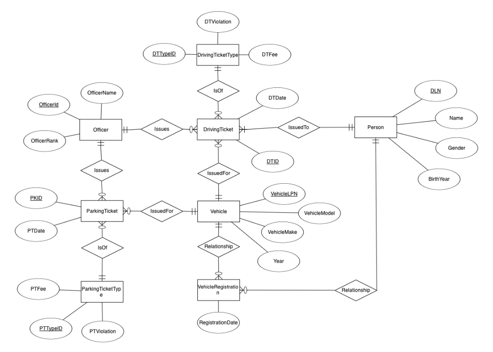
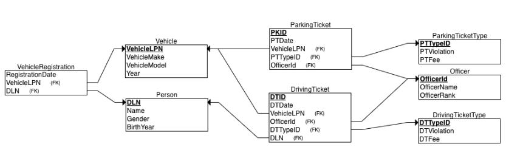

# City Police Operational Database

This database is designed to help a city police force manage parking and driving tickets efficiently by organizing data related to traffic violations, vehicles, and registered drivers. The Person table stores details about individuals, identified by their driver's license number (DLN). Each person can own or be associated with one or more Vehicle records, which store information such as license plate number (LPN), make, model, and year. The VehicleRegistration table links drivers to their vehicles by recording registration details.

Traffic violations are categorized into DrivingTicketType and ParkingTicketType, which define different types of infractions along with their corresponding fines. When an officer issues a ticket, it is recorded in either the DrivingTicket or ParkingTicket table, depending on the violation type. Each driving ticket is linked to a driver, their vehicle, the issuing officer, and a specific violation type, while parking tickets are associated with a vehicle, an officer, and a parking violation type. The Officer table stores information about police officers responsible for issuing tickets.

By structuring the data in this way, the database ensures that tickets are properly tracked, allowing law enforcement to retrieve details about past infractions, monitor repeat offenders, and enforce regulations effectively.

## Entity Relational Model



## Relational Model



## Source Code

* [Create Script (DDL](create.sql)
* [Populate Script (DML)](populate.sql)

## Sample Queries

 
### Query 1

What officer rank delivers the most driving tickets?

```
  select OfficerRank,count(1) CountByRank 
    from DrivingTicket,Officer
   where DrivingTicket.OfficerId=Officer.OfficerId
group by officerRank 
```

### Query 2

What is the most commonly registered vehicle make?

```
 select VehicleMake,count(1) from vehicle V,VehicleRegistration R
 where v.VehicleLPN=r.VehicleLPN
 group by vehicleMake
 ```

### Query 3

List all officers, and total ticket value

```
select OfficerName,sum(fee) TicketValue from (
select OfficerName, o.OfficerId,DTFee Fee 
  from drivingticket dt,DrivingTickettype dtt ,officer o
 where dt.DTTypeID=dtt.DTTypeID
   and dt.OfficerId=o.OfficerId
UNION
select OfficerName,o.officerId,PTFee Fee
  from ParkingTicket pt,ParkingTicketType ptt, officer o
where   pt.PTTypeID=ptt.PTTypeID
  and  pt.OfficerId=o.OfficerId
) as tickets
 group by officerName
 ```